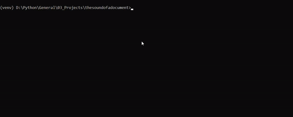
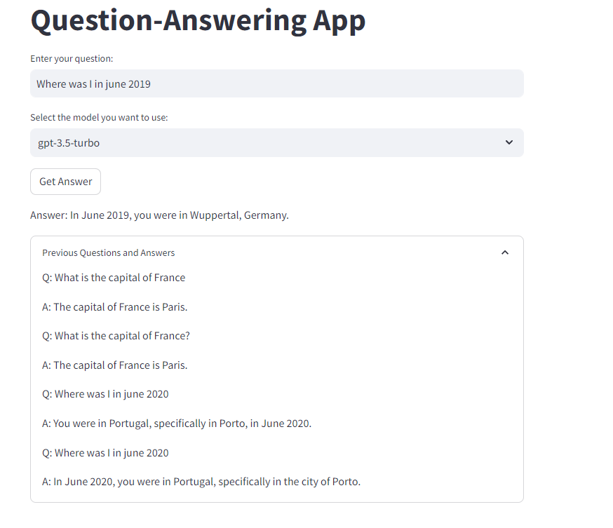

# The sound of a document :musical_note:
  
(Image from bing image generator)
## Description
### In this repository we make our documents talk to us. :musical_note:
We will be using the power of  Retrieval Augmented Generation (RAG) together with Large Language Models(LLM).  

The model will find its way through our documents, databases and other sources until it is sure it can answer the questions properly. 

### Note
We will use different sources, and information that the model has not been trained with. The information needs to be retrieved for the model to use it. We will present this information in the context window.

I might or might not use Streamlit to examplify the results

## Usage
**Alternative 1 - Terminal:** 
```bash
python main.py -v -q "What is the capital of France"
```
**Alternative 2 - Streamlit:**
```bash
streamlit run streamlit_app.py
```
## Knowledge Base

- **Vectorstore** Chroma vectorstore of major countries from wikipedia (This is only for the purpose of exemplifying the use of a vectorstore).
If you want to replicate the datasets used, [Utils](./utils/) contains all the notebooks to generate the temperature dataset as well as create your own vectorstore with wikipedia data.
For the embedding I decided to use [BAAI/bge-base-en-v1.5 embeddings](!https://huggingface.co/BAAI/bge-base-en-v1.5). See [create_chroma_db](./utils/create_chroma_db.py) for info on how to create an embedded vectorstore and how to query it. I decided to do everything from scratch.
- **csv** with my personal past trips to these countries - this dataset can be considered the "personal info data" as nothing of this will be available online.
- **SQL** temperature on these countries since the 90s until 2019 - created a [SQLite table called Temperature](./utils/sqlite_create.ipynb)
- **Wikipedia** for information about the countries : Last resource if we dont have enough info. We use the Wiki API

## LLM
For simplicity GPT-3.5 is used. But the project should be generalizable to any model. You will need to adjust your prompts and arguments
All used prompts for this project are stored in: [prompts](./prompts.py)

## Examples
Terminal  
  


Streamlit App  



## Notebooks
There is a test notebook that contains a follow through on tests for the different decisions of the LLM

## Aknowledgements
Temperature Dataset: https://www.kaggle.com/datasets/subhamjain/temperature-of-all-countries-19952020 


## License
This project contains content sourced from Wikipedia. The original content is released under the [Creative Commons Attribution-ShareAlike 3.0 Unported License](https://creativecommons.org/licenses/by-sa/3.0/). See the [LICENSE](./utils/wikipedia/LICENSE) file for the full license text.